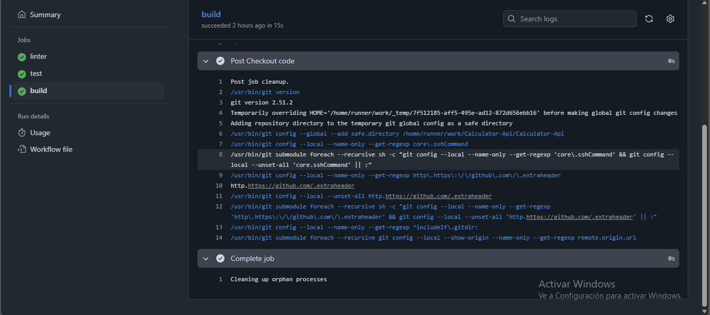
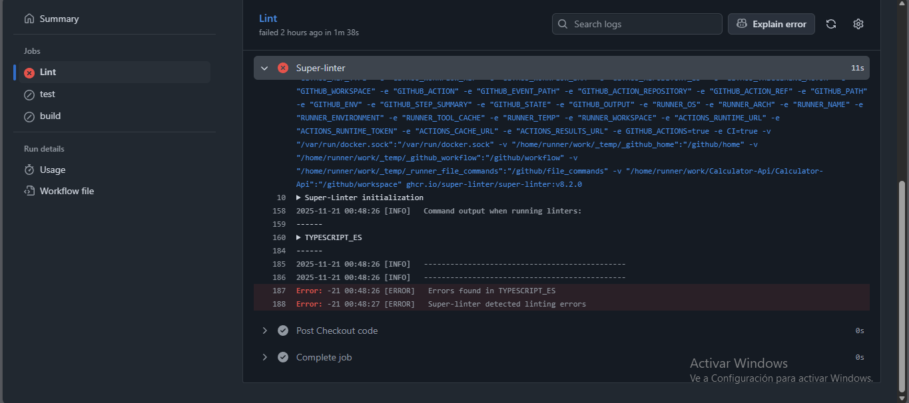

# 📘 API de Operaciones Matemáticas (Node + Express)

Esta es una API sencilla construida con **Node.js** y **Express** que
expone cuatro endpoints para realizar operaciones matemáticas básicas:

- **Addition** (suma)
- **Substraction** (resta)
- **Product** (multiplicación)
- **Division** (división)

## 🚀 Requisitos

- Node.js 18

## 📦 Instalación

```sh
npm install
```

## ▶️ Ejecutar el servidor

```sh
npm start
```

El servidor iniciará en:

    http://localhost:3000

## 🧪 Ejecutar pruebas

```sh
npm test
```

---

# **Capturas de pantalla de los logs**

### **Success**


### **Error**


---

# **1. Diferencia entre CI y CD**

### **CI – Continuous Integration (Integración Continua)**

Su objetivo es **validar automáticamente cada cambio en el código**.
Incluye:

- Ejecutar linters
- Correr pruebas unitarias
- Analizar cobertura
- Compilar el proyecto
- Verificar calidad

---

### **CD – Continuous Delivery / Deployment (Entrega / Despliegue Continuo)**

CD toma lo que CI ya validó y lo **empaqueta y despliega automáticamente** en un entorno:

- Development
- Staging
- Producción

---

# **2. Lenguaje, linter y herramienta de cobertura**

### **🔹 Lenguaje: Node.js + Express**

**Justificación:**

- Popular para APIs REST.
- Gran ecosistema (npm).
- Rápido para desarrollo backend.
- Integración fácil con Jest y ESLint.

---

### **🔹 Linter: ESLint**

**Justificación:**

- Estándar en JavaScript/TypeScript.
- Detecta errores comunes antes de ejecutar código.
- Reglas configurables para estilo y calidad.
- Integración perfecta con CI (GitHub Actions, GitLab CI, etc.).

---

### **🔹 Herramienta de cobertura: Jest Coverage (lcov)**

**Justificación:**

- Jest ya incluye sistema de cobertura integrado.
- Genera archivos **lcov.info** compatibles con todas las plataformas CI.
- Fácil de integrar con GitHub Actions y VeryGoodCoverage.
- No requiere instalar herramientas externas.

---

# **3. Umbral mínimo de cobertura**

### ✔️ **Recomendación:** **80%** de cobertura mínima global.

### **Justificación:**

- **Menos de 70%** suele dejar demasiado código sin testear.
- **Más de 90%** generalmente fuerza tests artificiales y no aporta valor real.
- **80%** es el punto ideal:

  - Se cubre la mayoría de funcionalidades críticas.
  - No obliga a escribir tests innecesarios.
  - Equilibrio entre calidad y velocidad de desarrollo

---

# **Resumen final**

| Tema                   | Respuesta                                      |
| ---------------------- | ---------------------------------------------- |
| **CI vs CD**           | CI valida el código, CD lo despliega           |
| **Lenguaje**           | Node.js (rápido, compatible, estándar en APIs) |
| **Linter**             | ESLint (mejor soporte para JS/TS)              |
| **Cobertura**          | Jest con lcov (integración nativa y sencilla)  |
| **Umbral recomendado** | **80%**, balance entre calidad y esfuerzo      |

# 🚀 **¿Qué es act?**

`act` es un CLI que simula el entorno de GitHub Actions en tu propia máquina usando **contenedores Docker**.
Fue creada para que puedas probar tus pipelines sin tener que hacer commits o esperar a que GitHub los ejecute.

---

# 🔧 **¿Qué hace act?**

### ✔️ 1. Ejecuta workflows como si estuvieran en GitHub Actions

Ejemplo:

```sh
act
```

Esto corre el workflow definido en `.github/workflows/...`.

---

### ✔️ 2. Te permite correr jobs específicos

```sh
act -j test
```

---

### ✔️ 3. Lee tus secretos desde `.secrets`

Puedes crear un archivo `.secrets` para simular tus `secrets.*` de GitHub.

```sh
act --secret-file .secrets
```

---

### ✔️ 4. Usa Docker para imitar los runners de GitHub

GitHub usa máquinas Linux (`ubuntu-latest`).
`act` usa imágenes Docker como:

- `act-latest`
- `ubuntu:latest`

Según el tamaño que elijas:

```sh
act -P ubuntu-latest=nektos/act-environments-ubuntu:18.04
```

---

### ✔️ 5. Permite depurar pipelines más rápido

Puedes ver errores de linters, tests, coverage, build, etc., **sin subir nada a GitHub**.

---

# 🎯 **¿Para qué sirve en la práctica?**

- Probar workflows antes de hacer commit
- Evitar pushes innecesarios
- Depurar fallos de CI
- Ejecutar jobs individualmente
- Simular eventos como `push`, `pull_request`, etc.

```sh
act pull_request
```
